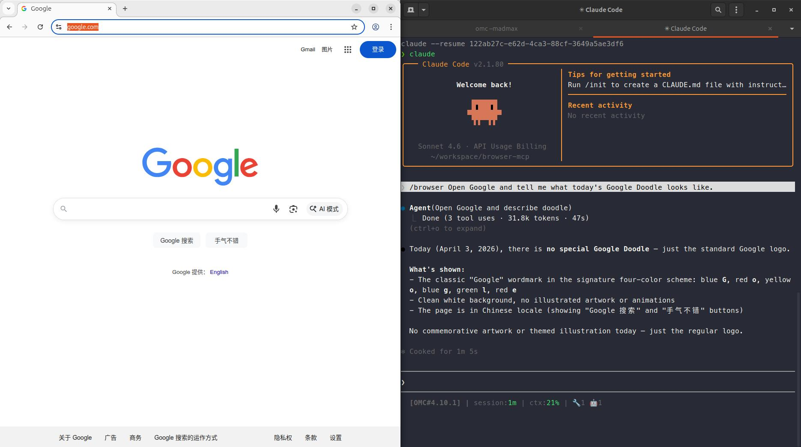

# browser-pilot

> Give AI agents a real browser. One command to install.

A lightweight MCP server that wraps [chrome-devtools-mcp](https://developer.chrome.com/blog/chrome-devtools-mcp) with automatic Chrome lifecycle management — works with Claude Code, Codex CLI, and Gemini CLI out of the box.

## What can you do with it?

- **Deep web research** — crawl multi-page sites, extract structured data, summarize articles, compare prices across tabs
- **Form automation** — fill and submit forms, upload files, interact with SPAs and dynamic content
- **Human-in-the-loop** — AI handles the tedious parts, pauses when a CAPTCHA or login appears, you solve it, AI continues
- **Screenshot & visual analysis** — capture pages and let the AI reason about layout, content, or visual changes
- **Scraping without APIs** — access any site a human can open, no API key required



## Install

```bash
npx --package=@yqi96/browser-pilot@latest browser-pilot-install
```

Detects which AI clients you have installed and registers itself automatically.

```bash
# Target a specific client
npx --package=@yqi96/browser-pilot@latest browser-pilot-install --client claude
npx --package=@yqi96/browser-pilot@latest browser-pilot-install --client codex
npx --package=@yqi96/browser-pilot@latest browser-pilot-install --client gemini
```

## What it does

- **Auto-launches Chrome** on first use (macOS / Linux / Windows)
- **Adds lifecycle tools** — `browser_open`, `browser_close`
- **Proxies all chrome-devtools-mcp tools** transparently (navigate, click, screenshot, fill forms, …)
- **Returns screenshots as base64** for direct multimodal AI processing

## Supported clients

| Client | Status | Skill command |
|--------|--------|---------------|
| Claude Code | ✅ Supported | `/browser` |
| Codex CLI | ✅ Supported | `$browser` |
| Gemini CLI | ⚡ Best-effort | `activate_skill("browser")` |

## Uninstall

```bash
npx --package=@yqi96/browser-pilot@latest browser-pilot-uninstall
```

## Contributing

Found a bug? Open an issue or, if you have Claude Code, clone the repo and let it fix it:

```bash
git clone https://github.com/yqi96/browser-pilot && cd browser-pilot && claude
```

PRs are welcome!

## License

MIT
